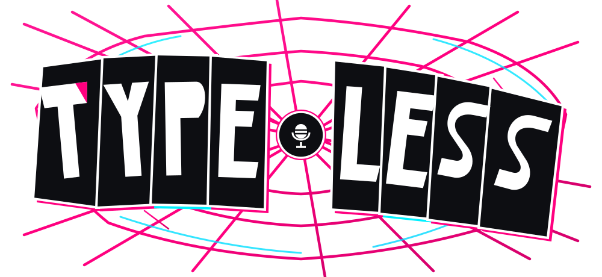

<div align="center">

# 🕷️ TypeLess

### Offline Push-to-Talk AI Voice Typing for Windows

[](https://tauri.app/)
[](https://www.rust-lang.org/)
[](https://react.dev/)
[](https://github.com/ggerganov/whisper.cpp)
[](https://opensource.org/licenses/MIT)

<br/>



<p align="center">
  <b>TypeLess</b> is a blazing-fast, 100% offline, privacy-first Push-to-Talk voice typing application for Windows.<br/>
  Powered by local <b>Whisper AI</b>, native Win32 keystroke simulation, dynamic hallucination filters, and an interactive <b>Miles Morales Desktop Pet</b>.
</p>

</div>

---

## ✨ Key Features

- 🎙️ **100% Offline & Private:** Runs local `whisper-cli` (`small` model) directly on your device. Zero cloud dependency, zero data leaks.
- ⚡ **Seamless Push-to-Talk:** Hold `Ctrl + Win` (or configurable hotkey), speak naturally in Indonesian or English, and release. Text automatically types into whichever active window you are focused on!
- 🕷️ **Interactive Spider-Verse Pet Overlay:** An animated Miles Morales mascot pops up above the taskbar when listening, pulses with audio RMS waveforms, and triggers Spider-Sense electric waves during transcription.
- 🎚️ **System Tray Microphone Selector:** Dynamically switch audio input devices on the fly directly from the native Windows System Tray menu.
- 🧹 **Zero-Hallucination Cleaner:** Proprietary regex and subtitle hallucination cleaner removes common whisper repetition loops and subtitle artifacts.
- 🛡️ **Tauri v2 & Rust Core:** Lightweight RAM footprint (~35MB), instantaneous startup, and memory-safe architecture.

---

## 🚀 Quick Start

### Prerequisites
- **Node.js**: v18+ and `npm`
- **Rust**: `rustc` and `cargo` (latest stable)
- **Windows 10/11**: 64-bit

### 1. Clone Repository
```bash
git clone https://github.com/syans-OG/TypeLess.git
cd TypeLess
```

### 2. Install Dependencies
```bash
npm install
```

### 3. Run in Development Mode
```bash
npm run tauri dev
```

### 4. Build Production Installer
```bash
npm run tauri build
```

---

## 🎨 Visual Identity & Brand System

| Asset | Preview | Description |
| :--- | :---: | :--- |
| **Logotype (Wordmark)** | [`typeless-wordmark.svg`](./typeless-wordmark.svg) | *Spider-Punk* anarchic collage lettering with raw neon web background |
| **App & Tray Icon** | [`app-icon.svg`](./app-icon.svg) | Clean Studio Condenser Microphone Pin Badge with chromatic glitch shadows |

---

## 🛠️ Architecture & Tech Stack

```
TypeLess/
├── src-tauri/               # Native Rust Backend
│   ├── src/
│   │   ├── asr.rs          # Whisper process runner & model manager
│   │   ├── audio.rs        # CPAL high-performance audio capture & RMS stream
│   │   ├── cleaner.rs      # Hallucination filter & punctuation normalizer
│   │   ├── hotkey.rs       # Global Windows hotkey listener (Push-to-Talk)
│   │   ├── injector.rs     # Win32 SendInput Unicode text injector
│   │   └── lib.rs          # Tauri app entrypoint & system tray menu
│   └── capabilities/       # Least-privilege security configuration
│
└── src/                     # React + TypeScript Frontend
    ├── components/
    │   ├── MilesSpideyPet.tsx # Vector Spider-Verse mascot animation
    │   └── PetOverlay.tsx     # Overlay window controller & audio reactive bubble
    └── styles/              # Vanilla CSS spring animations & glow filters
```

---

## 📄 License

Distributed under the **MIT License**. See `LICENSE` for more information.

---

<div align="center">
  Crafted with ❤️ for high-performance voice productivity.
</div>
